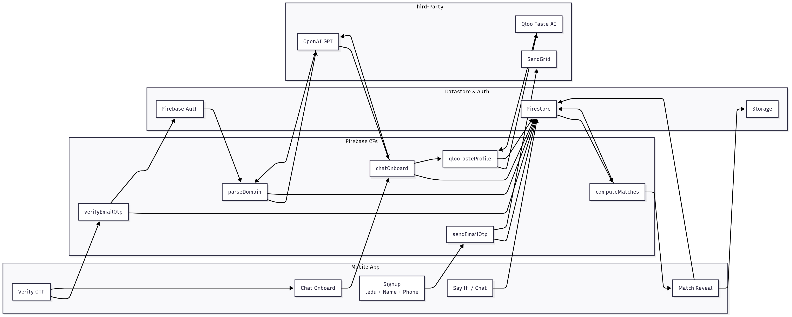

# Vybr - College Roommate Finder 🏠

Find your perfect roommate through AI-powered personality matching. Built for college students who are tired of random roommate assignments.

## What it does
- **Email OTP login** - Only .edu emails allowed (keeps it college-only)
- **AI personality quiz** - Chat with GPT to find your vibe
- **Smart matching** - Uses your music taste and lifestyle to find compatible roommates
- **Mobile app** - React Native so it works on iPhone and Android

## Tech Stack
- React Native + Expo (mobile app)
- Firebase (auth + database)
- Firebase Functions (email sending)
- OpenAI GPT (personality assessment)
- Qloo API (taste matching)

## Architecture & Data Flow




## How to run locally

1. **Clone and install**
```bash
git clone https://github.com/yourusername/vybr.git
cd vybr
npm install
```

2. **Set up Firebase**
- Create Firebase project at console.firebase.google.com
- Enable Authentication > Email/Password
- Create Firestore database
- Copy your config to `.env`

3. **Email setup** (for OTP codes)
```bash
# In your Gmail account:
# 1. Turn on 2-factor auth
# 2. Generate app password 
# 3. Add to .env file
```

4. **Deploy functions and run**
```bash
firebase deploy --only functions
npm start
```

## File structure
```
vybr-app/
├── App.js                    # Clean navigation logic
├── src/
│   ├── screens/
│   │   ├── AuthScreen.js     # Email OTP (extracted from App.js)
│   │   ├── OnboardingScreen.js
│   │   └── MatchingScreen.js
│   └── services/
│       ├── firebase.js       # Firebase OTP service
│       └── openai.js         # OpenAI service
|       └── qloo.js           # Qloo service
├── package.json
└── .env
```

## Environment variables
Create `.env` file:
```
FIREBASE_API_KEY=your_key
FIREBASE_AUTH_DOMAIN=your_domain
FIREBASE_PROJECT_ID=your_project
GMAIL_USER=your_email@gmail.com
GMAIL_APP_PASSWORD=your_app_password
```

## Features working now
- ✅ Email OTP verification
- ✅ User signup/login
- ✅ Basic profile creation
- ✅ University verification
- ✅ Onboarding and Matching UI
- ✅ GPT personality chat
- ✅ Matching logic

## Still building
- 🚧 Chat between matches
- 📋 Profile pictures

